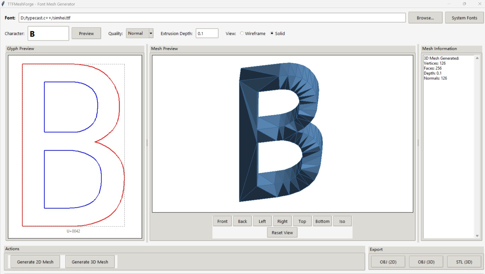

# TTFMeshForge - TrueType Font to Mesh Converter

A Python library and GUI application for converting TrueType font glyphs into 2D/3D triangular meshes.

## Features

- Parse TrueType fonts (.ttf, .ttc)
- Convert glyph outlines to triangular meshes
- Support for both 2D and 3D mesh generation
- Multiple triangulation algorithms (Delaunay, ear clipping)
- Export meshes to OBJ and STL formats
- Built-in 3D viewer

## Installation

```bash
pip install -r requirements.txt
```

## Requirements

- Python 3.8+
- numpy
- matplotlib
- shapely
- fonttools

## Quick Start

### GUI Application

Run the graphical interface:

```bash
python TTFMeshForge_GUI.py
```

### Python API

```python
import ttf2mesh

# Load a font file
result, font = ttf2mesh.ttf_load_from_file("path/to/font.ttf")

if result == ttf2mesh.TTF_DONE:
    # Find glyph for a character
    glyph_idx = ttf2mesh.ttf_find_glyph(font, ord('A'))
    
    if glyph_idx >= 0:
        glyph = font.glyphs[glyph_idx]
        
        # Convert glyph to mesh
        mesh = ttf2mesh.ttf_glyph2mesh(glyph)
        
        # Export to OBJ
        ttf2mesh.mesh_to_obj(mesh, "output.obj")
        
        # Export to STL
        ttf2mesh.mesh_to_stl(mesh, "output.stl")
```

## API

### Loading Fonts

- `ttf_load_from_file(filename)` - Load a font from file
- `ttf_find_glyph(font, char_code)` - Find glyph index for a character

### Mesh Generation

- `ttf_glyph2mesh(glyph, quality=TTF_QUALITY_NORMAL, features=0)` - Convert glyph to 2D mesh
- `ttf_glyph2mesh3d(glyph, depth=1.0, quality=TTF_QUALITY_NORMAL)` - Convert glyph to 3D mesh

### Export

- `mesh_to_obj(mesh, filename)` - Export mesh to Wavefront OBJ format
- `mesh_to_stl(mesh, filename)` - Export mesh to STL format

### Quality Levels

- `TTF_QUALITY_LOW` - 10 curve steps
- `TTF_QUALITY_NORMAL` - 20 curve steps (default)
- `TTF_QUALITY_HIGH` - 50 curve steps

## Project Structure

```
TTFMeshForge/
├── ttf2mesh/                    # Library module
│   ├── __init__.py              # Module exports
│   ├── core.py                  # Core data structures
│   ├── parser.py                # TTF font parser
│   ├── mesher.py                # Triangulation mesher
│   ├── outline.py               # Outline processing
│   ├── mesh.py                  # Mesh data structures
│   ├── fontlist.py              # Font enumeration
│   ├── earclipping.py           # Ear clipping algorithm
│   ├── font2tri_lib.py          # Font triangulation utilities
│   └── viewer3d.py              # 3D visualization
├── TTFMeshForge_GUI.py          # Main GUI application
└── README.md                    # Project documentation
```

## GUI Features

The TTFMeshForge GUI provides a user-friendly interface for:

- Loading TTF fonts from file or system font list
- Previewing glyph outlines with color-coded contours (outer: red, inner: blue)
- Generating 2D triangular meshes with adjustable quality
- Generating 3D extruded meshes with configurable depth
- Interactive 3D mesh viewing (rotate, zoom, preset views)
- Exporting meshes to OBJ, STL, and SVG formats

## License

MIT License

## Author

Yuming Xu

---
